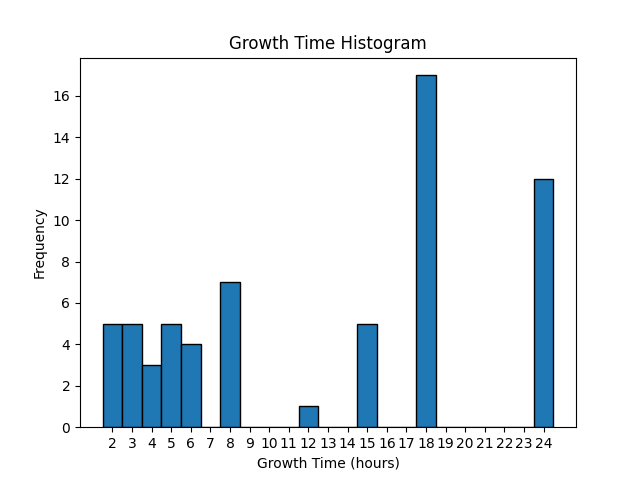

# Berries API Documentation

This is a simple API that provides information about berries. The data is fetched from the external [PokeAPI](https://pokeapi.co/). It provides the following endpoints:

## `GET /allBerryStats`

This endpoint provides various statistics about the growth times of all berries. 

### Response

A JSON object containing:
- `berries_names`: A list of all berries names
- `min_growth_time`: The minimum growth time among all berries
- `median_growth_time`: The median growth time among all berries
- `max_growth_time`: The maximum growth time among all berries
- `variance_growth_time`: The variance of growth times among all berries
- `mean_growth_time`: The mean growth time among all berries
- `frequency_growth_time`: A frequency distribution of the growth times

The `allBerryStats` endpoint responds with JSON data. The `Content-Type` header is set to `application/json`.

### Example

```bash
GET https://berry-api.onrender.com/allBerryStats
```
## `GET /histogram`
This endpoint provides an image of a histogram of the berries' growth times.

### Response

An HTML image tag that references a PNG image of the histogram.


### Example
``




```bash
GET https://berry-api.onrender.com/histogram
```

# Deployment

The API is deployed on Render and can be accessed at the following URL:

```plaintext
https://berry-api.onrender.com
```

# Local Developement
To run this API locally, you will need Python 3.6 or higher and Flask. Clone the repository and install the required dependencies:

```bash
git clone https://github.com/anamichelch/berries-pokeapi.git
```
Then, navigate into the directory and install the required dependencies:
```bash
cd berries-pokeapi
pip install -r requirements.txt
```
Then, to start the server, run:
```bash
python app.py
```

The server will start on http://0.0.0.0:5000/.
# Caching
This API uses caching to reduce the number of requests to the external API and to speed up responses. The cache lasts for 2 minutes.

